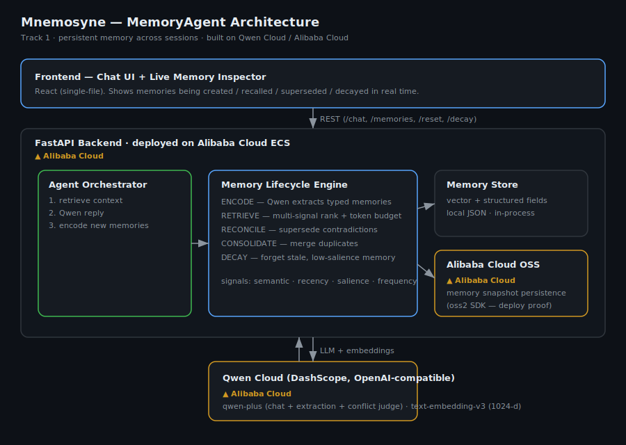

# 🧠 Mnemosyne — A MemoryAgent with a Real Memory Lifecycle

**Global AI Hackathon with Qwen Cloud · Track 1: MemoryAgent**

Mnemosyne is a personal AI assistant whose memory is a **living lifecycle**, not a vector dump. It autonomously accumulates experience, remembers your preferences, recalls the right context within a limited token budget, forgets what's stale, and **reconciles contradictions** — superseding outdated facts instead of letting them rot alongside the truth.

Most "memory" agents do naive RAG: embed everything, cosine top-k, stuff it in the prompt. Track 1 explicitly asks for the parts they skip — *timely forgetting* and *recalling critical memories within limited context windows*. Mnemosyne is built around exactly those hard problems.



---

## What makes it different — the Memory Lifecycle Engine

| Operation | Naive RAG | Mnemosyne |
|---|---|---|
| **Encode** | Dump raw turns into a vector index | Qwen **extracts atomic, typed memories** (fact / preference / event / relationship) with salience + entities |
| **Retrieve** | Top-k cosine | **Multi-signal ranking** (semantic · recency · salience · access-frequency) + **token-budget-aware packing** |
| **Reconcile** | Keep contradictions side by side | New facts that contradict old ones **supersede** them; the old fact is archived with a pointer |
| **Consolidate** | Duplicates accumulate | Near-duplicate memories merge and strengthen |
| **Forget** | Memory grows forever | Salience **decays** with age; faded, unused memories are archived |

Each operation maps directly to a Track-1 focus area: *efficient storage/retrieval*, *timely forgetting*, *recall within limited context*.

---

## Built on Qwen Cloud (Alibaba Cloud)

- **`qwen-plus`** — conversation, structured memory extraction, and the contradiction judge
- **`text-embedding-v3`** (1024-d) — semantic similarity for retrieval, dedup, and conflict pre-ranking
- OpenAI-compatible API via `https://dashscope-intl.aliyuncs.com/compatible-mode/v1`
- **Alibaba Cloud OSS** (`oss2` SDK) persists the memory store — see [`backend/app/storage/oss_client.py`](backend/app/storage/oss_client.py) (the deployment-proof file)
- Backend deployed on **Alibaba Cloud ECS** — see [`docs/ALIBABA_CLOUD.md`](docs/ALIBABA_CLOUD.md)

---

## Quick start

```bash
# 1. Backend
cd backend
python -m venv .venv
.venv\Scripts\Activate.ps1        # Windows  (source .venv/bin/activate on macOS/Linux)
pip install -r requirements.txt
copy .env.example .env            # then paste your Qwen Cloud key into DASHSCOPE_API_KEY

python check_connection.py        # confirms your key works
uvicorn app.main:app --port 8000  # start the API
```

```bash
# 2. Frontend (separate terminal)
cd frontend
python -m http.server 5500
# open http://localhost:5500
```

OSS is optional for local use — if the `OSS_*` vars in `.env` are blank, the store falls back to local JSON automatically.

---

## Try it (the 30-second demo)

1. `I live in New York and prefer short answers` → two typed memories appear in the inspector.
2. `Where do I live?` → answers **New York**, recalled from memory (watch the card flash) — even though this is a "new session".
3. `Actually I just moved to Berlin` → the New York card turns **red and strikes through** (superseded); Berlin appears active.

That's encode → cross-session recall → reconcile, visible live.

---

## Benchmark — lifecycle vs naive RAG

`benchmark/run_benchmark.py` plants 32 facts across a session (5 critical, 25
distractors, 2 later **contradictions** — a relocation and a job change), then
asks 5 recall questions. Both systems compete under the **same 120-token context
budget**. The decisive metric is measured at the *memory layer*, not the answer:

| Metric | Mnemosyne | Naive RAG |
|---|---:|---:|
| Answer accuracy | 5/5 | 5/5 |
| **Stale facts in retrieved context** | **0** | **2** |
| Context tokens used | 591 | 681 |

**Why it matters:** Mnemosyne *supersedes* outdated facts at write-time, so
"lives in New York" and "is a backend engineer" never reach the context window
once the user moves and changes jobs. Naive RAG keeps every version forever and
leans on the LLM to untangle the contradiction at read-time — which wastes
budget and fails silently as memory grows or the answering model gets weaker.
Same end-answer today, fundamentally more reliable memory.

Reproduce: `cd backend && python ..\benchmark\run_benchmark.py`

## API

| Endpoint | Method | Purpose |
|---|---|---|
| `/chat` | POST | `{message, session_id}` → reply + recalled + newly-learned memories + token usage |
| `/memories` | GET | full memory set (for the inspector) |
| `/decay` | POST | run the forgetting pass; returns # archived |
| `/reset` | POST | wipe memory (clean demos) |
| `/health` | GET | liveness + whether OSS is wired |

---

## Repository layout

```
backend/
  app/
    llm/qwen_client.py        # all Qwen Cloud calls (chat / chat_json / embed)
    memory/models.py          # Memory dataclass + lifecycle status
    memory/engine.py          # ★ the Memory Lifecycle Engine (encode/retrieve/reconcile/decay)
    storage/store.py          # pluggable store (local JSON + OSS sync)
    storage/oss_client.py     # Alibaba Cloud OSS — deployment proof
    agent.py                  # chat orchestrator
    main.py                   # FastAPI app
  check_connection.py         # key sanity check
  smoke_test.ps1              # end-to-end lifecycle test
frontend/index.html           # chat UI + live memory inspector (single file)
benchmark/                    # recall vs naive-RAG comparison
docs/architecture.svg         # architecture diagram
docs/ALIBABA_CLOUD.md         # deployment proof writeup
```

## License

MIT — see [LICENSE](LICENSE).
